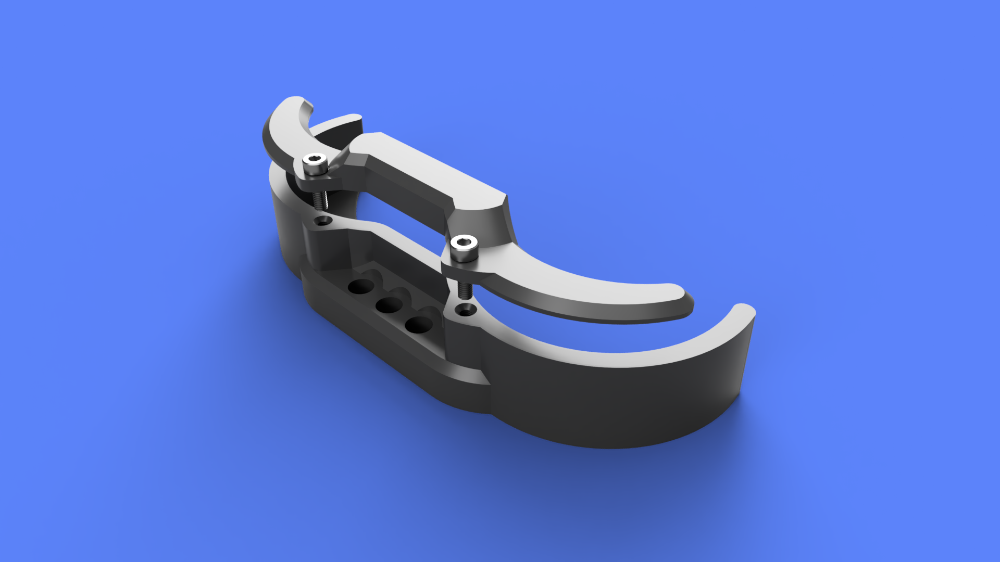
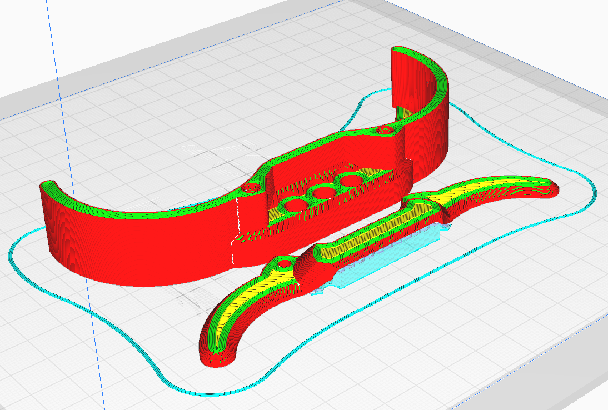

## OSSM Remote Mount

  
  

**Summary**  
This is a remote mount for the wired OSSM remote  

Uses M6x20mm bolt with T Nut to hold in place  

Center bolt intended to be used alone for mounting perpendicular to 4040 rail  
End bolts intended to be used for mounting parallel to 4040 rail  

**Hardware**  
- 2x M3x10 bolts

**Printing**  
Print with 3 walls (More or less to vary "clip" stiffness feeling)  
Use supports for Top

**Assembly**  
Pieces connect using M3x10 bolts